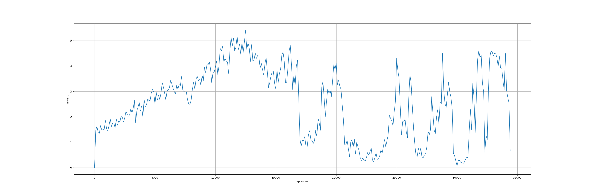

# HTW_AI_Gym
This is a project for a AI course at the HTW Berlin. I'm trying to implement an AI Agent that can play old Atari Games in Open AI Gym using a deep q neural network.
## Table of contents
1. [Introduction to the Project](#introduction-to-the-project)
2. [Explaining the Theory](#explaining-the-theory)
3. [The Journey](#the-journey)

## Introduction to the Project

## Explaining the Theory

## The Journey

#### Preface
The goal is to create an AI Agent that plays Atari Games.
When this semester started I already knew I wanted to do something like this, but I have never done anything with Neural Networks before,
therefore I needed to learn how to work with them. I already knew the basic theory stuff, but never used something like Keras or Tensorlfow.
So the first things to do were: Getting used to Python (I am still not used to it though), learn how Keras works and what it does.
Before I started searching the webs on how to implement an AI Agent that plays games, I though about genetic algorithms for that, 
I realised soon that there are better ways: Deep Q Nerual Networks. Therefore I started several times throughout this semester to
learn about them.

#### Day One
Today is the 9th of march. I finally got time to start working on this project. It has been a few weeks since I read the last time
about Deep Q NNs, so I started the day with reading again through the impressively good [articles](https://medium.freecodecamp.org/an-introduction-to-reinforcement-learning-4339519de419 "First Article of this series") 
of Thomas Simonini. Right now I am at the [third](https://medium.freecodecamp.org/an-introduction-to-deep-q-learning-lets-play-doom-54d02d8017d8 "Starting to learn about Deep Q NN")
article again and try to understand how it all works. While reading this I'm starting to try to implement one myself into my project.

I've gone through the tutorials now and realized that I need to find a way to feed my keras neural network while it is running. It is obvious in hindsight, but I didn't think of it before. I'm quite exhausted now, so I'll find a solution tomorrow.

#### Day Two
10th of march. The way I used Keras before was just with the train method. I've found a tutorial where someone is using the train_on_batch method. That is exactly what I needed, but I need to get everything ready first and I'm still not quite confident in my understanding of this topic. So I'm still following the tutorials from Thomas Simonini. But as the Doom-Example is way over the top for my purpose I started looking at the source of this [deep q learningspace invaders](https://github.com/simoninithomas/Deep_reinforcement_learning_Course/blob/master/Deep%20Q%20Learning/Space%20Invaders/DQN%20Atari%20Space%20Invaders.ipynb) and implemented it the same way just in Keras. I'm not quite done yet. I'm now at the part, where the AI starts learning. For that I will need the train_on_batch method. But as those topics are quite complicated to grasp and my concentration is depleted I will pause for now. Maybe I'll continue later this day.

#### Day Three
12th of march. Yesterday I didn't really do anything but reading through source code and fiddling with the code. Turns out I didn't really understood how numpy arrays work, as I gave up on trying to get my training batch of states into one array. So today I took a look at those numpy arrays and came to the realization that I just have to do the same thing I already did with the frame stacks. The solution is probably horrible but it works. So Today I could finally start training my AI-Agent... I think. I didn't endure long enough to really see if something is happening, because it was training somewhat slow... so I checked if Keras is using my GPU but nope, it didn't. So I took a look into that and now I can't run my script anymore. So I've been going through tutorials on how to properly install tensorflow-gpu, cuda, nvidia drivers and so on for about 3 hours... just love it.
In the end tensorflow finally saw that cuda is indeed installed, but some kernels had different versions. So I guess I'm doing it all over again. Great.

#### Day Four
13th of march. Yesterday around midnight I managed to fix the nvidia, cuda, keras errors. For anyone who needs help with this aswell [this](https://github.com/rnreich/ubuntu-tensorflow-gpu-all-versions) is a great source for help. Protip: Scroll down first - there is a "fast route"... And the currently the correct version is 1.12.0 with up to date keras and graphics cards drivers with compute capabbalities of 6.1. So after it worked I went to bed. The next morning I wanted to let my AI Agent train while I'm at work - but after a while my computer wouldn't work anymore. I checked the ram and yep - it was fully taken. Apparently you shouldn't trust tutorials. The source of evil was the memory buffer, which the tutorial set to a size of 1 million. To get a good size with my ram I just printed the length of the memory list and watched my RAM fill up. It took around 2500 memories before my RAM was full, so I decided that 2000 memories where a good starting point. After the neural net worked I wanted to visualize some things, so I looked into drawing graphs in python. Matplotlib is exactly what you need for that. Gladly I found a bug today. As I tracked some stuff I discovered that the probability was starting at 0.99, was going down and jumped up again. Turned out I reset the step counter each episode which is not what I want, so I moved it up. Tomorrow I will let the ai agent train 1000 episodes of breakout or until I come back from work. Hopefully it will somewhat work and I just have to tweak it a little bit. We'll see. 

#### Day Five
14th of march. The Neural Network I made is garbage. As you can see [here](res/first_try/ai_agent_graph_first_try.png) it didn't quite learn to do anything. Also I realized that I need to add how much reward it is getting each episode. 
So it's back to the drawing board. But I have a better understanding of this topic. Nevertheless I will read again about it and look at repositories and learn from them.

#### Day Six
15th of march. I started reading the [minh paper](https://www.cs.toronto.edu/~vmnih/docs/dqn.pdf) and testing a dqn agent from the [keras-rl repository](https://github.com/keras-rl/keras-rl "keras-rl") I stumpled across today. While the Agent was learning I read through the paper and wrote down some notes. The first thing I noticed was that the learning was **much** faster than the one on my neural network. Secondly they did indeed use 1 million memories, but I saved them as float32 while they did as byte8. That happens when you're not comfortable with a programming language. Also their input image was 84x84x4 (reason is, that the convolution they used needed a square array) while mine was not. I will change that in the next version. And their neural network hat different values on the filters, kernels and strides. I probably take the one from the [keras-rl repository](https://github.com/keras-rl/keras-rl "keras-rl") mentioned before. Another big difference was that they used frame skips! What they did was letting the AI Agent perform an action and then repeating this action the next 3 frames. Except for Space Invaders. That could be one reason why my neural network was quite slow. The next step from now is to look through the code of this keras-rl repo and looking at how they did things. And I probably should learn how to manipulate numpy arrays correctly, how to stack them, how to change their content from e.g. float32 to byte8 and so on.

#### Many days later
23rd of march. I spend the last days with taking a deep look into my code and really understand what is happening. And I came to the conclusion that it should work, but I probably wasn't training it long enough. I changed some hyper parameters, deleted some unnecessary code/comments. Also I got removed the normalization of the input images, because I got an extremely low total_loss after each training session. Now I got something between x - 0.00x. And then I let it train for the past three days. So in total that should be around 72 hours. Oh, and I also did double deep q learning this time, because it is quite easy to implement. It just means you have a neural network that you train and one that decides (called target network). The weights of the target network get periodically updated to match the ones of the nn that decides the actions. The reason to do it that way is for stability. [Here](https://medium.freecodecamp.org/improvements-in-deep-q-learning-dueling-double-dqn-prioritized-experience-replay-and-fixed-58b130cc5682) is a good article explaining the reasons on why to use ddqn.
The results are following:
#### Rewards per Episode averaged by 10

#### Rewards per Episode averaged by 100

#### Unfortunately pyplot automatically plots from lowest to highest x-value, so you have to read the following graphs from right to left.
#### Rewards dependent on the probability the neural network decides the action averaged by 10

#### Rewards dependent on the probability the neural network decides the action averaged by 100

As you can see this time the neural network did learn *something*. It peaked when it had around 37% chance of deciding what to do. As it got more and more resposibility the rewards started fluctuating. At this time I didn't know why and I suspected the lack of memories. I "only" had 200.000 memories. I thought it might forget what it learned before and starts learning it all over again, but instead of getting better it just forgets the status quo and learns to play the game again. But after the last low I stopped the learning. I saved the weights of the last peak before and I wanted to see what the agent actually did there. And surprisingly it did quite good. It doesn't look like random actions anymore, it knew what to do. After it got some points and lost a live it just stoped doing anything, because it was satisfied with what it got. So after the 50000 steps limit a new episode started. And it learned from those many episodes of doing nothing to do... well, nothing. That is why it started fluctuating. And as the random actions got lower and lower it couldn't explore the environment anymore and it dependet on memories that got slowly overwritten by doing nothing. I think the following are steps I need to take:
- the agent needs to be punished for doing nothing for a longer period of time when a game starts
- change the structure of the program from episodes/steps to just steps, as many repositories doing ddqn do it like that. It makes it easier to adjust hyper parameters
- change the decay of exploration to a more linear and approach, so I can actually tell after how many steps the lower limit is reached.
- change some hyper paremets to fit the new approach of just counting steps
- expand the memories a little bit more (low priority, as it seems to work nevertheless)

Just a clarification: A step is one action the neural network decides, not the number of frames that have passed.

#### Many days later + 1
24th of march. I realized a big mistake I did before. When I introduced frame skipping I also introduced a bug into my neural network: When the environment granted a reward for destroying a block the reward was immediately overwritten by zero points for the next frame if it wasn't the last frame in the sequence. Therefore the agent didn't get rewards for doing good. Luckily I just realized that while re-implementing the logic. I hopefully fixed that by accumulating the rewards per sequence and then clipping it to 1. Also I've implemented a punishment for doing nothing for a certain amount of steps at the start of a round. I haven't tested it so I hope I didn't do it wrong. I also changed the calculation of the probability for the agent to take actions. Now I am able to define a certain amount of steps after which the highest probability is reached.

#### Many days later + 1
25th of march. Results of the test:
#### Breakout. The results averaged by the last 100 episodes:

It is learning.. something. Unfortunately it seems to get stuck. But it's doing better than before. Also I've fixed some problems with the diagram that I had in the last pictures. Also I changed the script which reads the trainings log and draws the diagrams to take in arguments (filename and average). But Unfortunately I made a mistake with the "doing nothing" thing, because the "done" flag is obviously not set when losing a life. Therefore it did nothing. To get the information about the lifes I need to get it from the "info" dictionary the env.step(action) method gives back. I get the current lifes by calling info['ale.lives'].

#### Many days later + 3
27th of march. I've been testing a lot recently. I came to the conclusion that Breakout might be somewhat hard, so I started testing pong with my neural network, because it also has losses. I tried normalizing the input again, but the loss got so low, that the weights changed so slowly that I couldn't see any progress over the night. 
#### Pong. The results averaged by the last 50 episodes:

As you can see it didn't learn anything therefore I stopped that and turned it back to the not normalized input.
#### Pong. The results averaged by the last 50 episodes:

Result of letting the nn train pong for like... ~30 hours. Averaged by the last 50 episodes.
As you can see it did learn something. But still it's incredibly time consuming and slow. I suspect the lack of memories, thats why I will start explicitly reading about how to implement the memory efficiently.

#### Many days later + 4
28th of march. I don't know why I didn't calculate the amount of RAM the memory takes earlier. One picture is a 84 x 84 uint8 matrix. 1 Million of those take 6.57gb of RAM. But as I those memories are a stack of 4 pictures it would take more than 26gb of RAM. Unfortunately that is a lot more than I have. So I looked again what other people did. Most of them didn't seem to bother, but some did. And I found [this](https://github.com/fg91/Deep-Q-Learning/blob/master/DQN.ipynb) and implemented the memory as shown. Unfortunately my network didn't learn anything after testing two different games (pong and breakout) for about 10 hours each. So I'm back at where I started. But today I got an Idea. I could try to concurrently compress the pictures with RLE. It's a quite simple algorithm, but it should work pretty well as most parts of the pictures are of the same color. I'll probably try to implement it over the weekend. For that I'll have to get familiar with concurrency in python. Doing that in sequence would probably slow too much down. Speaking of slowing down. I also looked into things that could slow my program down. Something that happens quite often is generating random numbers and I tested different methods of generating them. Namely random.random(), random.randrange(), np.random.randint() and np.random.rand(). I didn't test random.randint() because I already read that it is quite slow. The testcase was 1 million times 32 random numbers. Surprisingly the fastest method was random.random, even though I needed to multiply the result with a range and cast it into an int. E.q. int(random.random() * 1000000) would give an integer between 0 and 1 million - 1 (as the range of random.random is [0, 1)).

#### Many days later + 6
30th of match. Before I implement RLE I wanted to test the network on Breakout-v0 again with keeping track of the lifes and rounds it does nothing. I implemented a punishmend for losing a life, because previously losing a life in Breakout didn't do anything at all. There was just reward for breaking blocks, that's why it was so hard to train the agent. Also I added punishment for doing nothing for 30 decisions at the start of a round (the ball only spawns if you decide to move in either direction after losing a life).
The results of ~ 30 hours of training:

As you can see, the lowest value is now -2, because I added punishment. It is now possible to score negative rewards after a game. The agent learned faster and better than any of my previous agents. The maximum score I saw was 33 - even though he gets punished for losing a life. That was far more than the previous agents could do. 
The agent had a memory of 300.000, which was taking around 10gb of RAM. The agent had a steady increase of rewards, after 1.000.000 steps it seemed to stagnate. That was because the agent started to do nothing for several rounds. After 200.000 steps it learned that he gets punished for doing nothing. Sometimes you could see him wait for a period of time and then start moving - fearing the upcoming punishment if he didn't move. After that it seems that he reached the peak of what he is capable of, so I stopped the training. While the agent was training I already implemented an RLE compressing and decompressing algorithm. Now I had the opportunity to test if everything worked - and it did. But it consumed far more memory than I anticipated. Even more than the uncompressed version. That was because I used tuples to save compressed data and added those tuples to a list. E.g. 124, 124, 124, 124, 124 would become (124, 5) => the number 124 is written down 5 times. I researched a little bit and learned that lists have quite the overhead because they are mutable containers (e.g. you can add items at runtime). Therefore I tried converting them into numpy arrays before I returned the compressed image. And finally it worked. It is quite slow, but it consumes far less memory than before. Now I'm trying to use multiprocessing to concurrently compress and decompress data. As I can mess up a lot of code I want to push the current state before starting to implement multiprocessing. It is not hard to go back to not using compression currently.

#### Final Day
3th of April.
Firstly, I want to correct myself. I spoke of concurrency the last time, but that is not what I need. I needed parallelism, because my problem is CPU-Bound and not IO-Bound. In Python multithreading means running multiple threads on the same cpu core, while multiprocessing means running multiple processes on several cpus cores. Unfortunately I didn't achieve a speed that was acceptable so I have to live with only 300.000 memories with 16gb RAM. Maybe one day, when I know Python better I will be able to make it work.
Two days ago I started a training session until today, unfortunately I had some little mistakes in my new architecture. As result the NN didn't learn anything. But I fixed that now. I also tested the new architecture with already trained agents and saw that it didn't work as planned. When Playing I loaded the weights to the target_model and not to the model, so I fixed that aswell. Now everything should be working hopefully. Now I will let the Pong-Agent train some more with the weights of the previously trained agent, as I don't have much time left unfortunately. I will write some documentation into the code now but I won't change any code unless I find another bug. I will now write a "how to use" and some of the theory behind DQN learning.
